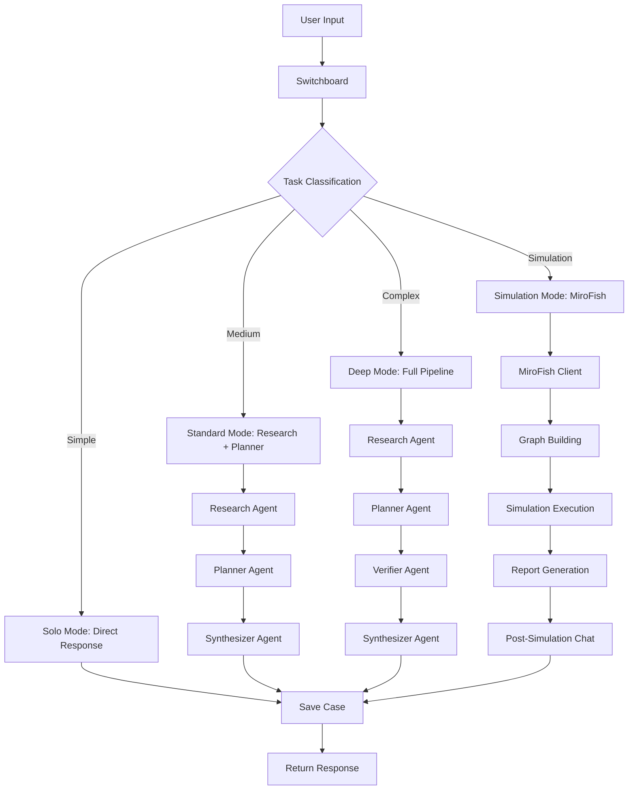

# Design Document: MiroOrg v1.1

## Overview

MiroOrg v1.1 is a general intelligence operating system that orchestrates multiple specialist agents, runs simulations, supports pluggable domain packs, and autonomously improves itself over time. The system merges capabilities from miroorg-basic-v2 (base architecture), impact_ai (first domain pack), MiroFish (simulation lab), and public-apis (API discovery catalog) into a unified, production-ready platform.

### Core Principles

- **Modularity**: Clear separation between core platform, agent organization, domain packs, simulation lab, and autonomous learning
- **Extensibility**: Domain packs can be added without modifying agent orchestration layer
- **Provider Agnostic**: Abstract AI model providers (OpenRouter, Ollama, future OpenAI) behind unified interface
- **Local-First**: Single-user local deployment with production-quality code structure
- **Simulation-Ready**: Deep integration with MiroFish for scenario modeling and what-if analysis
- **Self-Improving**: Autonomous learning from internet knowledge, past cases, and successful patterns without local model training
- **Resource-Conscious**: Strict storage limits and lightweight background tasks suitable for 8GB/256GB laptop

### System Context

The system operates as a FastAPI backend with a Next.js frontend dashboard. All state is stored locally in JSON files. External services (MiroFish, Tavily, NewsAPI, Alpha Vantage) are accessed through adapter clients. The architecture supports both synchronous analysis and asynchronous simulation workflows.

## Architecture

### Five-Layer Architecture

```
┌─────────────────────────────────────────────────────────────┐
│ Layer 5: Autonomous Knowledge Evolution (Self-Improvement) │
│ - World knowledge ingestion (compressed summaries)          │
│ - Experience learning from cases                            │
│ - Prompt evolution and optimization                         │
│ - Skill distillation from patterns                          │
│ - Trust and freshness management                            │
└─────────────────────────────────────────────────────────────┘
                            ▲
                            │
┌─────────────────────────────────────────────────────────────┐
│ Layer 4: Simulation Lab (MiroFish Integration)             │
│ - Graph building, persona generation, simulation execution  │
│ - Report generation, post-simulation chat                   │
└─────────────────────────────────────────────────────────────┘
                            ▲
                            │
┌─────────────────────────────────────────────────────────────┐
│ Layer 3: Domain Packs (Pluggable Intelligence Modules)     │
│ - Finance Pack: market data, news, entity/ticker detection │
│ - Future: Policy, Cyber, Enterprise Ops, Research, Edu     │
└─────────────────────────────────────────────────────────────┘
                            ▲
                            │
┌─────────────────────────────────────────────────────────────┐
│ Layer 2: Agent Organization (Multi-Agent Orchestration)    │
│ - Switchboard: routing and classification                  │
│ - Research: context gathering and entity extraction        │
│ - Planner: action plan generation                          │
│ - Verifier: credibility validation and uncertainty         │
│ - Synthesizer: final response composition                  │
└─────────────────────────────────────────────────────────────┘
                            ▲
                            │
┌─────────────────────────────────────────────────────────────┐
│ Layer 1: Core Platform (Infrastructure)                    │
│ - FastAPI backend, Next.js frontend                        │
│ - Config, health, memory, prompts, cases, logs             │
│ - Provider abstraction layer                               │
└─────────────────────────────────────────────────────────────┘
```


### Execution Flow



### Repository Ownership

- **Primary Repo**: miroorg-basic-v2 (canonical architecture)
- **Domain Source**: impact_ai (reusable domain modules, not structural peer)
- **Simulation Service**: MiroFish (separate service, accessed via adapter)
- **API Catalog**: public-apis (discovery dataset, not runtime dependency)

### Technology Stack

- **Backend**: Python 3.10+, FastAPI, LangGraph, Pydantic, httpx
- **Frontend**: Next.js 14+, React, TypeScript, Tailwind CSS
- **Storage**: Local JSON files (cases, simulations, logs)
- **AI Providers**: OpenRouter (primary), Ollama (fallback), future OpenAI
- **External APIs**: Tavily, NewsAPI, Alpha Vantage, Jina Reader
- **Simulation**: MiroFish (external service)

## Components and Interfaces

### Layer 1: Core Platform

#### Provider Abstraction Layer

**Purpose**: Unified interface for AI model providers with automatic fallback

**Interface**:
```python
def call_model(
    prompt: str,
    mode: str = "chat",  # "chat" or "reasoner"
    system_prompt: Optional[str] = None,
    provider_override: Optional[str] = None,
) -> str:
    """
    Call AI model with automatic provider fallback.
    
    Args:
        prompt: User prompt or agent instruction
        mode: "chat" for general tasks, "reasoner" for complex analysis
        system_prompt: Optional system-level instructions
        provider_override: Force specific provider (testing/debugging)
    
    Returns:
        Model response text
    
    Raises:
        LLMProviderError: When all providers fail
    """
```

**Implementation Strategy**:
- Current: `_call_openrouter()` and `_call_ollama()` in `backend/app/agents/_model.py`
- Enhancement: Add `_call_openai()` for future OpenAI support
- Fallback Logic: Try primary provider, catch exception, try fallback provider
- Logging: Log provider selection, fallback events, and failures


#### Configuration Management

**Purpose**: Centralized environment-based configuration

**File**: `backend/app/config.py`

**Configuration Groups**:
1. **App Settings**: VERSION, DIRS (prompts, data, memory, simulations, logs)
2. **Provider Settings**: PRIMARY_PROVIDER, FALLBACK_PROVIDER, model names, API keys
3. **External API Settings**: TAVILY_API_KEY, NEWSAPI_KEY, ALPHAVANTAGE_API_KEY, JINA_READER_BASE
4. **MiroFish Settings**: ENABLED, API_BASE, TIMEOUT, endpoint paths
5. **Simulation Settings**: TRIGGER_KEYWORDS (configurable list)

**Enhancement Strategy**:
- Add validation on startup for required keys
- Add warnings for missing optional keys
- Add feature flags for domain packs
- Add logging configuration

#### Memory and Storage

**Purpose**: Local persistence for cases, simulations, and logs

**Directory Structure**:
```
backend/app/data/
├── memory/          # Case execution records (JSON)
├── simulations/     # Simulation metadata (JSON)
└── logs/            # Application logs (rotating)
```

**Case Storage Interface**:
```python
def save_case(case_id: str, payload: Dict[str, Any]) -> None
def get_case(case_id: str) -> Optional[Dict[str, Any]]
def list_cases(limit: Optional[int] = None) -> List[Dict[str, Any]]
def delete_case(case_id: str) -> bool
def memory_stats() -> Dict[str, Any]
```

**Simulation Storage Interface**:
```python
def save_simulation(simulation_id: str, record: Dict[str, Any]) -> None
def get_simulation(simulation_id: str) -> Optional[Dict[str, Any]]
def list_simulations(limit: Optional[int] = None) -> List[Dict[str, Any]]
```

**Case Schema**:
```json
{
  "case_id": "uuid",
  "user_input": "string",
  "route": {
    "task_family": "normal|simulation",
    "domain_pack": "finance|general|policy|custom",
    "complexity": "simple|medium|complex",
    "execution_mode": "solo|standard|deep"
  },
  "outputs": [
    {
      "agent": "research|planner|verifier|synthesizer",
      "summary": "string",
      "details": {},
      "confidence": 0.0
    }
  ],
  "final_answer": "string",
  "simulation_id": "optional uuid",
  "created_at": "ISO timestamp",
  "updated_at": "ISO timestamp"
}
```


### Layer 2: Agent Organization

#### Switchboard Agent

**Purpose**: Classify tasks and route to appropriate execution mode

**Current Implementation**: `backend/app/agents/switchboard.py`

**Classification Dimensions**:
1. **task_family**: "normal" or "simulation" (based on trigger keywords)
2. **domain_pack**: "finance", "general", "policy", "custom" (future enhancement)
3. **complexity**: "simple" (≤5 words), "medium" (≤25 words), "complex" (>25 words)
4. **execution_mode**: "solo", "standard", "deep"

**Routing Logic**:
```python
def decide_route(user_input: str) -> Dict[str, Any]:
    """
    Classify task and determine execution path.
    
    Returns:
        {
            "task_family": str,
            "domain_pack": str,
            "complexity": str,
            "execution_mode": str,
            "risk_level": str
        }
    """
```

**Enhancement Strategy**:
- Add domain_pack detection (keywords: "stock", "market", "ticker" → finance)
- Add entity extraction for domain routing
- Add confidence scoring for routing decisions
- Add routing decision logging

**Execution Mode Mapping**:
- **solo**: Simple queries, direct response, no multi-agent collaboration
- **standard**: Medium complexity, Research → Planner → Synthesizer
- **deep**: Complex queries, full pipeline with Verifier, optional simulation handoff

#### Research Agent

**Purpose**: Gather context, extract entities, fetch external information

**Current Implementation**: `backend/app/agents/research.py`

**Responsibilities**:
1. Extract entities (companies, people, concepts)
2. Extract tickers (stock symbols like $AAPL)
3. Extract URLs for content reading
4. Fetch external context (Tavily search, NewsAPI, Alpha Vantage, Jina Reader)
5. Return structured facts, assumptions, open questions, useful signals

**Interface**:
```python
def run_research(user_input: str, prompt_template: str) -> Dict[str, Any]:
    """
    Gather context and extract entities from user input.
    
    Returns:
        {
            "agent": "research",
            "summary": str,
            "details": {
                "external_context_used": bool,
                "entities": List[str],
                "tickers": List[str],
                "urls": List[str]
            },
            "confidence": float
        }
    """
```

**Enhancement Strategy**:
- Integrate impact_ai entity_resolver.py for better entity extraction
- Integrate impact_ai ticker_resolver.py for ticker normalization
- Add structured entity extraction (not just text summary)
- Add domain-specific context gathering (finance pack)
- Add caching for repeated queries


#### Planner Agent

**Purpose**: Convert research into practical action plans

**Current Implementation**: `backend/app/agents/planner.py`

**Responsibilities**:
1. Synthesize research findings into actionable recommendations
2. Highlight dependencies and risks
3. Suggest next steps
4. Identify when simulation mode would be more appropriate

**Interface**:
```python
def run_planner(
    user_input: str,
    research_summary: str,
    prompt_template: str
) -> Dict[str, Any]:
    """
    Generate action plan from research findings.
    
    Returns:
        {
            "agent": "planner",
            "summary": str,
            "details": {
                "recommendations": List[str],
                "risks": List[str],
                "next_steps": List[str],
                "simulation_suggested": bool
            },
            "confidence": float
        }
    """
```

**Enhancement Strategy**:
- Add structured output parsing (recommendations, risks, next_steps)
- Add simulation mode detection and suggestion
- Add domain-specific planning (finance pack)
- Update prompt to include domain intelligence instructions

#### Verifier Agent

**Purpose**: Validate credibility, detect rumors/scams, surface uncertainty

**Current Implementation**: `backend/app/agents/verifier.py`

**Responsibilities**:
1. Test credibility of information sources
2. Detect rumors and unsupported claims
3. Detect scams and fraudulent information
4. Identify contradictions in research and planning
5. Force uncertainty to be made visible

**Interface**:
```python
def run_verifier(
    user_input: str,
    research_summary: str,
    planner_summary: str,
    prompt_template: str
) -> Dict[str, Any]:
    """
    Validate credibility and detect issues.
    
    Returns:
        {
            "agent": "verifier",
            "summary": str,
            "details": {
                "credibility_score": float,
                "rumors_detected": List[str],
                "scams_detected": List[str],
                "contradictions": List[str],
                "uncertainty_areas": List[str]
            },
            "confidence": float
        }
    """
```

**Enhancement Strategy**:
- Integrate impact_ai source_checker.py for source credibility scoring
- Integrate impact_ai rumor_detector.py for rumor detection
- Integrate impact_ai scam_detector.py for scam detection
- Add structured output parsing
- Update prompt with domain intelligence instructions
- Only run in "deep" execution mode


#### Synthesizer Agent

**Purpose**: Combine outputs into final comprehensive response

**Current Implementation**: `backend/app/agents/synthesizer.py`

**Responsibilities**:
1. Combine research, planning, and verification outputs
2. State uncertainty honestly
3. Recommend next actions
4. Suggest simulation mode when scenario analysis is appropriate

**Interface**:
```python
def run_synthesizer(
    user_input: str,
    research_summary: str,
    planner_summary: str,
    verifier_summary: str,
    prompt_template: str
) -> Dict[str, Any]:
    """
    Produce final comprehensive response.
    
    Returns:
        {
            "agent": "synthesizer",
            "summary": str,
            "details": {
                "uncertainty_level": str,
                "next_actions": List[str],
                "simulation_recommended": bool
            },
            "confidence": float
        }
    """
```

**Enhancement Strategy**:
- Add structured output parsing
- Add uncertainty quantification
- Add simulation mode recommendation logic
- Update prompt with domain intelligence instructions

### Layer 3: Domain Packs

#### Domain Pack Architecture

**Purpose**: Pluggable domain intelligence modules that extend agent capabilities

**Design Pattern**:
```
backend/app/domain_packs/
├── __init__.py
├── base.py              # Abstract base class for domain packs
├── finance/             # First domain pack (from impact_ai)
│   ├── __init__.py
│   ├── market_data.py   # Alpha Vantage integration
│   ├── news.py          # NewsAPI integration
│   ├── entity_resolver.py
│   ├── ticker_resolver.py
│   ├── source_checker.py
│   ├── rumor_detector.py
│   ├── scam_detector.py
│   ├── stance_detector.py
│   ├── event_analyzer.py
│   └── prediction.py
└── registry.py          # Domain pack registration and discovery
```

**Base Domain Pack Interface**:
```python
class DomainPack(ABC):
    """Abstract base class for domain packs."""
    
    @property
    @abstractmethod
    def name(self) -> str:
        """Domain pack identifier (e.g., 'finance', 'policy')."""
        pass
    
    @property
    @abstractmethod
    def keywords(self) -> List[str]:
        """Keywords for automatic domain detection."""
        pass
    
    @abstractmethod
    def enhance_research(self, user_input: str, context: Dict[str, Any]) -> Dict[str, Any]:
        """Enhance research agent with domain-specific context."""
        pass
    
    @abstractmethod
    def enhance_verification(self, claims: List[str], context: Dict[str, Any]) -> Dict[str, Any]:
        """Enhance verifier agent with domain-specific checks."""
        pass
    
    @abstractmethod
    def get_capabilities(self) -> List[str]:
        """List domain-specific capabilities."""
        pass
```


#### Finance Domain Pack

**Purpose**: Financial intelligence capabilities from impact_ai

**Modules to Integrate**:

1. **market_data.py**: Alpha Vantage client for stock quotes, historical data
2. **news.py**: NewsAPI client for financial news
3. **entity_resolver.py**: Extract and normalize company/organization names
4. **ticker_resolver.py**: Resolve company names to stock tickers
5. **source_checker.py**: Score credibility of financial news sources
6. **rumor_detector.py**: Detect unverified market rumors
7. **scam_detector.py**: Detect investment scams and fraud
8. **stance_detector.py**: Analyze sentiment and stance in financial text
9. **event_analyzer.py**: Analyze market events and their impacts
10. **prediction.py**: Market prediction and scenario modeling

**Integration Strategy**:
- Refactor impact_ai modules to match service layer pattern
- Consolidate overlapping clients (Alpha Vantage, NewsAPI) with existing external_sources.py
- Expose capabilities through FinanceDomainPack class
- Register pack in domain pack registry
- Update agent prompts to include finance-specific instructions when pack is active

**Finance Pack Interface**:
```python
class FinanceDomainPack(DomainPack):
    name = "finance"
    keywords = ["stock", "market", "ticker", "trading", "investment", "portfolio", 
                "earnings", "dividend", "IPO", "SEC", "financial"]
    
    def enhance_research(self, user_input: str, context: Dict[str, Any]) -> Dict[str, Any]:
        """
        Add financial context:
        - Extract tickers and resolve company names
        - Fetch market quotes
        - Fetch recent financial news
        - Extract financial entities
        """
        
    def enhance_verification(self, claims: List[str], context: Dict[str, Any]) -> Dict[str, Any]:
        """
        Add financial verification:
        - Check source credibility for financial news
        - Detect market rumors
        - Detect investment scams
        - Analyze stance and sentiment
        """
```

#### Domain Pack Registry

**Purpose**: Centralized registration and discovery of domain packs

**Interface**:
```python
class DomainPackRegistry:
    def register(self, pack: DomainPack) -> None
    def get_pack(self, name: str) -> Optional[DomainPack]
    def detect_domain(self, user_input: str) -> Optional[str]
    def list_packs(self) -> List[str]
    def get_capabilities(self, domain: str) -> List[str]

# Global registry instance
domain_registry = DomainPackRegistry()
domain_registry.register(FinanceDomainPack())
```

**Usage in Agents**:
```python
# In research agent
domain = domain_registry.detect_domain(user_input)
if domain:
    pack = domain_registry.get_pack(domain)
    enhanced_context = pack.enhance_research(user_input, base_context)
```


### Layer 4: Simulation Lab

#### MiroFish Integration Architecture

**Purpose**: External simulation service for scenario modeling and what-if analysis

**Integration Pattern**: Adapter client (not direct merge)

**Current Implementation**: `backend/app/services/mirofish_client.py`

**MiroFish Capabilities**:
1. **Graph Building**: Extract entities and relationships from seed text
2. **Persona Generation**: Create realistic personas for simulation
3. **Environment Setup**: Configure simulation parameters
4. **Simulation Execution**: Run multi-agent scenario modeling
5. **Report Generation**: Produce structured simulation reports
6. **Post-Simulation Chat**: Deep interaction with simulation results

**Client Interface**:
```python
def mirofish_health() -> Dict[str, Any]:
    """Check MiroFish service availability."""

def run_simulation(payload: Dict[str, Any]) -> Dict[str, Any]:
    """
    Submit simulation request.
    
    Payload:
        {
            "title": str,
            "seed_text": str,
            "prediction_goal": str,
            "mode": "standard|deep",
            "metadata": {}
        }
    
    Returns:
        {
            "simulation_id": str,
            "status": "submitted|running|completed|failed",
            "message": str
        }
    """

def simulation_status(simulation_id: str) -> Dict[str, Any]:
    """Get simulation execution status."""

def simulation_report(simulation_id: str) -> Dict[str, Any]:
    """Retrieve simulation report."""

def simulation_chat(simulation_id: str, message: str) -> Dict[str, Any]:
    """Ask questions about simulation results."""
```

**Router Implementation**: `backend/app/routers/simulation.py`

**Endpoints**:
- `GET /simulation/health`: MiroFish health check
- `POST /simulation/run`: Submit simulation
- `GET /simulation/{simulation_id}`: Get status
- `GET /simulation/{simulation_id}/report`: Get report
- `POST /simulation/{simulation_id}/chat`: Post-simulation chat

**Error Handling**:
- Graceful degradation when MiroFish is disabled
- Descriptive error messages for connection failures
- Local metadata storage even when remote service fails
- Timeout configuration via environment variables

**Frontend Integration Rule**: Frontend MUST only consume MiroOrg endpoints, never direct MiroFish calls


#### Simulation Workflow Integration

**Trigger Detection**: Switchboard detects simulation keywords and sets task_family="simulation"

**Simulation Keywords** (configurable):
- simulate, predict, model reaction, test scenarios, run digital twins
- explore "what if" outcomes, forecast, scenario analysis
- public opinion, policy impact, market impact, stakeholder reaction

**Execution Flow**:
1. User submits query with simulation keywords
2. Switchboard classifies as task_family="simulation", execution_mode="deep"
3. Research agent gathers context (optional)
4. Planner agent structures simulation parameters (optional)
5. System submits to MiroFish via `/simulation/run`
6. System polls `/simulation/{id}` for status
7. When complete, system retrieves report via `/simulation/{id}/report`
8. Synthesizer agent summarizes simulation results
9. User can ask follow-up questions via `/simulation/{id}/chat`

**Case Linking**: Simulation metadata includes case_id, case metadata includes simulation_id

### API Discovery Subsystem

**Purpose**: Discover and classify free APIs from public-apis catalog for future connector expansion

**Architecture**:
```
backend/app/services/api_discovery/
├── __init__.py
├── catalog_loader.py    # Load public-apis JSON data
├── classifier.py        # Classify APIs by category and usefulness
├── scorer.py            # Score APIs for integration priority
└── metadata_store.py    # Store API metadata locally
```

**Catalog Loader**:
```python
def load_public_apis_catalog() -> List[Dict[str, Any]]:
    """
    Load public-apis catalog from GitHub or local cache.
    
    Returns:
        List of API entries with:
        - API name
        - Description
        - Auth type (apiKey, OAuth, None)
        - HTTPS support
        - CORS support
        - Category
        - Link
    """
```

**Classifier**:
```python
def classify_api(api_entry: Dict[str, Any]) -> Dict[str, Any]:
    """
    Classify API by category and potential use cases.
    
    Categories:
        - market_data: Stock, crypto, commodities
        - news: News aggregation, RSS feeds
        - social: Social media, sentiment
        - government: Policy, regulations, open data
        - weather: Weather, climate
        - general: Utilities, reference data
    """
```

**Scorer**:
```python
def score_api_usefulness(api_entry: Dict[str, Any]) -> float:
    """
    Score API for integration priority (0.0 - 1.0).
    
    Factors:
        - Auth simplicity (no auth > apiKey > OAuth)
        - HTTPS support (required)
        - CORS support (preferred)
        - Category relevance to domain packs
        - Description quality
    """
```

**Usage**: Discovery subsystem is for future expansion, not runtime dependency


### Layer 5: Autonomous Knowledge Evolution

**Purpose**: Self-improving intelligence system that learns from internet knowledge, past cases, prompt evolution, and skill distillation without local model training

**Design Constraints**:
- NO local model training or fine-tuning
- NO large raw dataset storage
- Store only compressed summaries (2-4KB per item)
- Max knowledge cache: 200MB
- Lightweight background tasks only
- Battery-aware and resource-conscious
- Suitable for 8GB/256GB laptop

**Architecture**:
```
backend/app/services/learning/
├── __init__.py
├── knowledge_ingestor.py    # Ingest and compress external knowledge
├── knowledge_store.py        # Store compressed knowledge items
├── learning_engine.py        # Core learning logic and pattern detection
├── prompt_optimizer.py       # Prompt evolution and testing
├── skill_distiller.py        # Extract reusable skills from patterns
├── trust_manager.py          # Source reliability tracking
├── freshness_manager.py      # Information recency tracking
└── scheduler.py              # Lightweight background task scheduler
```

**Data Directories**:
```
backend/app/data/
├── knowledge/          # Compressed knowledge items (max 200MB)
├── skills/             # Distilled reusable skills
├── prompt_versions/    # Prompt version history
└── learning/           # Learning metadata and statistics
```

#### Knowledge Ingestion

**Purpose**: Continuously pull high-signal information and compress it

**Knowledge Item Schema**:
```python
class KnowledgeItem(BaseModel):
    id: str
    title: str
    summary: str  # 2-4KB compressed summary
    entities: List[str]
    claims: List[str]
    source_url: str
    source_type: str  # "news", "api", "search", "webpage"
    trust_score: float  # 0.0 - 1.0
    freshness_score: float  # 0.0 - 1.0
    domain_pack: Optional[str]  # "finance", "policy", etc.
    created_at: str
    expires_at: str
    metadata: Dict[str, Any]
```

**Ingestion Sources**:
- Tavily search results
- Jina Reader webpage summaries
- NewsAPI articles
- Alpha Vantage market data
- Domain-specific APIs
- Public-APIs catalog metadata

**Ingestion Rules**:
- Pull only during idle periods
- Respect API rate limits
- Compress immediately (no raw storage)
- Extract entities, claims, and key facts
- Score trust and freshness
- Set expiration based on domain rules

**Interface**:
```python
def ingest_from_search(query: str, max_items: int = 5) -> List[KnowledgeItem]:
    """Ingest knowledge from search results."""

def ingest_from_url(url: str) -> Optional[KnowledgeItem]:
    """Ingest knowledge from specific URL."""

def ingest_from_news(query: str, max_items: int = 5) -> List[KnowledgeItem]:
    """Ingest knowledge from news sources."""

def compress_content(raw_content: str, max_length: int = 4000) -> str:
    """Compress raw content to summary."""
```

#### Knowledge Store

**Purpose**: Store and retrieve compressed knowledge items

**Storage Strategy**:
- JSON files in `backend/app/data/knowledge/`
- One file per knowledge item
- Automatic cleanup of expired items
- Hard limit: 200MB total storage
- LRU eviction when limit reached

**Interface**:
```python
def save_knowledge(item: KnowledgeItem) -> None
def get_knowledge(item_id: str) -> Optional[KnowledgeItem]
def search_knowledge(query: str, domain: Optional[str] = None) -> List[KnowledgeItem]
def list_knowledge(limit: Optional[int] = None) -> List[KnowledgeItem]
def delete_expired_knowledge() -> int
def get_storage_stats() -> Dict[str, Any]
```

#### Experience Learning

**Purpose**: Learn from every case execution to improve future performance

**Case Learning Metadata**:
```python
class CaseLearning(BaseModel):
    case_id: str
    route_effectiveness: float  # Did routing work well?
    prompt_performance: Dict[str, float]  # Which prompts worked?
    provider_reliability: Dict[str, bool]  # Which providers succeeded?
    source_usefulness: Dict[str, float]  # Which sources were valuable?
    pattern_detected: Optional[str]  # Repeated pattern?
    corrections_made: List[str]  # User corrections?
    execution_time: float
    created_at: str
```

**Learning Rules**:
- Track every case execution
- Store only metadata (not full case duplicate)
- Detect repeated patterns across cases
- Update trust scores based on verification outcomes
- Identify successful routing strategies
- Track prompt effectiveness

**Interface**:
```python
def learn_from_case(case_id: str, case_data: Dict[str, Any]) -> CaseLearning
def detect_patterns(min_occurrences: int = 3) -> List[Dict[str, Any]]
def get_route_effectiveness(route_type: str) -> float
def get_prompt_performance(prompt_name: str) -> float
def recommend_improvements() -> List[str]
```

#### Prompt Evolution

**Purpose**: Controlled evolution of agent prompts through testing and comparison

**Prompt Version Schema**:
```python
class PromptVersion(BaseModel):
    name: str  # "research", "planner", etc.
    version: str  # "v1.0", "v1.1", etc.
    content: str
    status: str  # "active", "experimental", "archived"
    win_rate: float  # Success rate in tests
    test_count: int
    last_tested: str
    created_at: str
    metadata: Dict[str, Any]
```

**Evolution Process**:
1. Store current prompt as baseline version
2. Generate improved variant (using provider API)
3. Test variant on sampled tasks
4. Compare outcomes using quality metrics
5. Promote if better, archive if worse
6. Never auto-promote without validation

**Quality Metrics**:
- Response relevance
- Entity extraction accuracy
- Credibility detection rate
- User satisfaction (if available)
- Execution time

**Interface**:
```python
def create_prompt_variant(prompt_name: str, improvement_goal: str) -> PromptVersion
def test_prompt_variant(variant: PromptVersion, test_cases: List[str]) -> float
def compare_prompts(baseline: PromptVersion, variant: PromptVersion) -> Dict[str, Any]
def promote_prompt(prompt_name: str, version: str) -> None
def archive_prompt(prompt_name: str, version: str) -> None
def get_prompt_history(prompt_name: str) -> List[PromptVersion]
```

#### Skill Distillation

**Purpose**: Convert repeated successful patterns into reusable skills

**Skill Schema**:
```python
class Skill(BaseModel):
    name: str  # "financial_rumor_review", "policy_reaction_analysis"
    description: str
    trigger_patterns: List[str]  # Keywords that activate this skill
    recommended_agents: List[str]  # Which agents to use
    preferred_sources: List[str]  # Which sources to prioritize
    prompt_overrides: Dict[str, str]  # Agent-specific prompt additions
    success_rate: float
    usage_count: int
    created_at: str
    last_used: str
    metadata: Dict[str, Any]
```

**Distillation Process**:
1. Detect repeated patterns (min 3 occurrences)
2. Extract common elements (agents, sources, prompts)
3. Create skill record
4. Test skill on similar tasks
5. Activate if success rate > 0.7

**Skill Types**:
- **financial_rumor_review**: Verify unverified market claims
- **policy_reaction_analysis**: Analyze policy impact scenarios
- **earnings_impact_brief**: Summarize earnings report impacts
- **simulation_prep_pack**: Prepare simulation parameters

**Interface**:
```python
def detect_skill_candidates(min_occurrences: int = 3) -> List[Dict[str, Any]]
def distill_skill(pattern: Dict[str, Any]) -> Skill
def test_skill(skill: Skill, test_cases: List[str]) -> float
def activate_skill(skill_name: str) -> None
def get_skill(skill_name: str) -> Optional[Skill]
def list_skills() -> List[Skill]
def apply_skill(skill_name: str, user_input: str) -> Dict[str, Any]
```

#### Trust Management

**Purpose**: Track source reliability and learn which sources are trustworthy

**Trust Score Schema**:
```python
class SourceTrust(BaseModel):
    source_id: str  # URL domain or API name
    source_type: str  # "news", "api", "website"
    trust_score: float  # 0.0 - 1.0
    verification_count: int
    success_count: int
    failure_count: int
    last_verified: str
    domain_pack: Optional[str]
    metadata: Dict[str, Any]
```

**Trust Scoring Rules**:
- Start with neutral score (0.5)
- Increase on successful verification
- Decrease on failed verification or detected misinformation
- Weight recent verifications more heavily
- Domain-specific trust (finance sources vs general sources)

**Interface**:
```python
def get_trust_score(source_id: str) -> float
def update_trust(source_id: str, verification_result: bool) -> None
def list_trusted_sources(min_score: float = 0.7) -> List[SourceTrust]
def list_untrusted_sources(max_score: float = 0.3) -> List[SourceTrust]
def get_trust_stats() -> Dict[str, Any]
```

#### Freshness Management

**Purpose**: Track information recency and identify stale knowledge

**Freshness Score Schema**:
```python
class FreshnessScore(BaseModel):
    item_id: str
    freshness_score: float  # 0.0 - 1.0
    created_at: str
    last_updated: str
    last_verified: str
    update_frequency: str  # "hourly", "daily", "weekly", "static"
    domain_pack: Optional[str]
    metadata: Dict[str, Any]
```

**Freshness Rules**:
- News: Degrades rapidly (hourly)
- Market data: Degrades moderately (daily)
- Policy info: Degrades slowly (weekly)
- Reference data: Static (no degradation)
- Recommend refresh when score < 0.5

**Interface**:
```python
def calculate_freshness(item: KnowledgeItem) -> float
def update_freshness(item_id: str) -> None
def get_stale_items(max_score: float = 0.5) -> List[str]
def recommend_refresh() -> List[str]
def get_freshness_stats() -> Dict[str, Any]
```

#### Learning Scheduler

**Purpose**: Lightweight background task scheduler with safeguards

**Scheduler Rules**:
- Run only when system is idle
- Max one background job at a time
- Small batch sizes (5-10 items per run)
- Stop on provider errors or rate limits
- Skip if battery low (<20%)
- Skip if CPU usage high (>70%)
- Respect API rate limits

**Scheduled Tasks**:
- Knowledge ingestion (every 6 hours)
- Expired knowledge cleanup (daily)
- Trust score updates (after each case)
- Freshness score updates (hourly)
- Pattern detection (daily)
- Skill distillation (weekly)
- Prompt optimization (weekly)

**Interface**:
```python
def schedule_task(task_name: str, interval: str, func: Callable) -> None
def run_once(task_name: str) -> Dict[str, Any]
def get_scheduler_status() -> Dict[str, Any]
def pause_scheduler() -> None
def resume_scheduler() -> None
def is_system_idle() -> bool
def is_battery_ok() -> bool
```

#### Learning Engine

**Purpose**: Core learning logic that coordinates all learning subsystems

**Responsibilities**:
- Inspect past cases for patterns
- Trigger knowledge ingestion
- Trigger skill distillation
- Recommend prompt upgrades
- Update trust and freshness scores
- Generate learning insights

**Interface**:
```python
def run_learning_cycle() -> Dict[str, Any]:
    """Run one complete learning cycle."""

def analyze_cases(limit: int = 100) -> Dict[str, Any]:
    """Analyze recent cases for patterns."""

def generate_insights() -> Dict[str, Any]:
    """Generate learning insights and recommendations."""

def get_learning_status() -> Dict[str, Any]:
    """Get current learning system status."""
```

#### Integration with Existing Layers

**With Cases**:
- Learn from every case execution
- Store case learning metadata
- Detect patterns across cases

**With Domain Packs**:
- Domain-specific knowledge ingestion
- Domain-specific trust scoring
- Domain-specific freshness rules

**With Simulation**:
- Learn from simulation outcomes
- Store simulation insights
- Improve simulation parameter selection

**With Prompts**:
- Version all prompts
- Test prompt variants
- Promote better prompts

**With Providers**:
- Track provider reliability
- Learn optimal provider selection
- Adapt to provider failures


## Data Models

### Core Schemas

**UserTask**:
```python
class UserTask(BaseModel):
    user_input: str
```

**RouteDecision**:
```python
class RouteDecision(BaseModel):
    task_family: Literal["normal", "simulation"]
    domain_pack: str  # "finance", "general", "policy", "custom"
    complexity: Literal["simple", "medium", "complex"]
    execution_mode: Literal["solo", "standard", "deep"]
    risk_level: str
    confidence: float = 0.0
```

**AgentOutput**:
```python
class AgentOutput(BaseModel):
    agent: str
    summary: str
    details: Dict[str, Any] = Field(default_factory=dict)
    confidence: float = 0.0
    timestamp: str
```

**CaseRecord**:
```python
class CaseRecord(BaseModel):
    case_id: str
    user_input: str
    route: RouteDecision
    outputs: List[AgentOutput]
    final_answer: str
    simulation_id: Optional[str] = None
    created_at: str
    updated_at: str
```

**SimulationRequest**:
```python
class SimulationRunRequest(BaseModel):
    title: str
    seed_text: str
    prediction_goal: str
    mode: str = "standard"
    metadata: Dict[str, Any] = Field(default_factory=dict)
```

**SimulationRecord**:
```python
class SimulationRecord(BaseModel):
    simulation_id: str
    status: Literal["submitted", "running", "completed", "failed"]
    title: str
    prediction_goal: str
    remote_payload: Dict[str, Any]
    report: Optional[Dict[str, Any]] = None
    case_id: Optional[str] = None
    created_at: str
    updated_at: str
```

### Domain Pack Schemas

**EntityExtraction**:
```python
class EntityExtraction(BaseModel):
    entities: List[str]
    tickers: List[str]
    companies: List[str]
    people: List[str]
    locations: List[str]
    confidence: float
```

**CredibilityScore**:
```python
class CredibilityScore(BaseModel):
    source: str
    score: float  # 0.0 - 1.0
    factors: Dict[str, Any]
    warnings: List[str]
```

**MarketQuote**:
```python
class MarketQuote(BaseModel):
    symbol: str
    price: float
    change: float
    change_percent: float
    volume: int
    timestamp: str
```

### Learning Layer Schemas

**KnowledgeItem**:
```python
class KnowledgeItem(BaseModel):
    id: str
    title: str
    summary: str  # 2-4KB compressed summary
    entities: List[str]
    claims: List[str]
    source_url: str
    source_type: Literal["news", "api", "search", "webpage"]
    trust_score: float  # 0.0 - 1.0
    freshness_score: float  # 0.0 - 1.0
    domain_pack: Optional[str]
    created_at: str
    expires_at: str
    metadata: Dict[str, Any] = Field(default_factory=dict)
```

**CaseLearning**:
```python
class CaseLearning(BaseModel):
    case_id: str
    route_effectiveness: float
    prompt_performance: Dict[str, float]
    provider_reliability: Dict[str, bool]
    source_usefulness: Dict[str, float]
    pattern_detected: Optional[str]
    corrections_made: List[str]
    execution_time: float
    created_at: str
```

**PromptVersion**:
```python
class PromptVersion(BaseModel):
    name: str
    version: str
    content: str
    status: Literal["active", "experimental", "archived"]
    win_rate: float
    test_count: int
    last_tested: str
    created_at: str
    metadata: Dict[str, Any] = Field(default_factory=dict)
```

**Skill**:
```python
class Skill(BaseModel):
    name: str
    description: str
    trigger_patterns: List[str]
    recommended_agents: List[str]
    preferred_sources: List[str]
    prompt_overrides: Dict[str, str]
    success_rate: float
    usage_count: int
    created_at: str
    last_used: str
    metadata: Dict[str, Any] = Field(default_factory=dict)
```

**SourceTrust**:
```python
class SourceTrust(BaseModel):
    source_id: str
    source_type: Literal["news", "api", "website"]
    trust_score: float  # 0.0 - 1.0
    verification_count: int
    success_count: int
    failure_count: int
    last_verified: str
    domain_pack: Optional[str]
    metadata: Dict[str, Any] = Field(default_factory=dict)
```

**FreshnessScore**:
```python
class FreshnessScore(BaseModel):
    item_id: str
    freshness_score: float  # 0.0 - 1.0
    created_at: str
    last_updated: str
    last_verified: str
    update_frequency: Literal["hourly", "daily", "weekly", "static"]
    domain_pack: Optional[str]
    metadata: Dict[str, Any] = Field(default_factory=dict)
```


## Service Layer Organization

### External Sources Service

**Purpose**: Unified interface for external API integrations

**Current Implementation**: `backend/app/services/external_sources.py`

**Capabilities**:
- URL extraction and content reading (Jina Reader)
- Web search (Tavily)
- News search (NewsAPI)
- Market quotes (Alpha Vantage)
- Ticker extraction from text

**Enhancement Strategy**:
- Consolidate with impact_ai Alpha Vantage and NewsAPI clients
- Add connection pooling
- Add request timeouts
- Add caching for market quotes (5 minute TTL)
- Add rate limiting

### Agent Registry Service

**Purpose**: Centralized agent registration and discovery

**Current Implementation**: `backend/app/services/agent_registry.py`

**Interface**:
```python
def list_agents() -> List[Dict[str, Any]]
def get_agent(agent_name: str) -> Optional[Dict[str, Any]]
def run_single_agent(agent: str, user_input: str, **context) -> Dict[str, Any]
```

**Enhancement Strategy**:
- Add agent capability metadata
- Add agent dependency tracking
- Add agent health checks

### Case Store Service

**Purpose**: Local persistence for case execution records

**Current Implementation**: `backend/app/services/case_store.py`

**Interface**:
```python
def save_case(case_id: str, payload: Dict[str, Any]) -> None
def get_case(case_id: str) -> Optional[Dict[str, Any]]
def list_cases(limit: Optional[int] = None) -> List[Dict[str, Any]]
def delete_case(case_id: str) -> bool
def memory_stats() -> Dict[str, Any]
```

**Enhancement Strategy**:
- Add case search by user_input
- Add case filtering by route parameters
- Add case export functionality

### Simulation Store Service

**Purpose**: Local persistence for simulation metadata

**Current Implementation**: `backend/app/services/simulation_store.py`

**Interface**:
```python
def save_simulation(simulation_id: str, record: Dict[str, Any]) -> None
def get_simulation(simulation_id: str) -> Optional[Dict[str, Any]]
def list_simulations(limit: Optional[int] = None) -> List[Dict[str, Any]]
```

### Prompt Store Service

**Purpose**: Dynamic prompt management

**Current Implementation**: `backend/app/services/prompt_store.py`

**Interface**:
```python
def list_prompts() -> List[str]
def get_prompt(name: str) -> Optional[Dict[str, Any]]
def update_prompt(name: str, content: str) -> Dict[str, Any]
```

**Enhancement Strategy**:
- Add prompt versioning
- Add prompt validation
- Add domain-specific prompt templates

### Health Service

**Purpose**: System health monitoring

**Current Implementation**: `backend/app/services/health_service.py`

**Interface**:
```python
def deep_health() -> Dict[str, Any]:
    """
    Comprehensive health check.
    
    Returns:
        {
            "status": "ok|degraded|error",
            "version": str,
            "checks": {
                "providers": {...},
                "external_apis": {...},
                "mirofish": {...},
                "storage": {...},
                "domain_packs": {...}
            }
        }
    """
```


## Frontend Architecture

### Technology Stack

- **Framework**: Next.js 14+ with App Router
- **UI Library**: React 18+
- **Styling**: Tailwind CSS
- **State Management**: React hooks + Context API
- **HTTP Client**: fetch API with error handling
- **Type Safety**: TypeScript

### Page Structure

```
frontend/src/app/
├── layout.tsx           # Root layout with navigation
├── page.tsx             # Main dashboard (landing)
├── analyze/
│   └── page.tsx         # Analyze mode interface
├── cases/
│   ├── page.tsx         # Case history list
│   └── [id]/
│       └── page.tsx     # Case detail view
├── simulation/
│   ├── page.tsx         # Simulation interface
│   └── [id]/
│       └── page.tsx     # Simulation detail and chat
├── prompts/
│   └── page.tsx         # Prompt lab
└── config/
    └── page.tsx         # System configuration view
```

### Component Architecture

```
frontend/src/components/
├── layout/
│   ├── Header.tsx
│   ├── Navigation.tsx
│   └── Footer.tsx
├── analyze/
│   ├── TaskInput.tsx
│   ├── ModeSelector.tsx
│   ├── ResultViewer.tsx
│   └── AgentOutputPanel.tsx
├── cases/
│   ├── CaseList.tsx
│   ├── CaseCard.tsx
│   └── CaseDetail.tsx
├── simulation/
│   ├── SimulationForm.tsx
│   ├── SimulationStatus.tsx
│   ├── SimulationReport.tsx
│   └── SimulationChat.tsx
├── prompts/
│   ├── PromptList.tsx
│   └── PromptEditor.tsx
└── common/
    ├── Badge.tsx
    ├── Card.tsx
    ├── LoadingSpinner.tsx
    └── ErrorMessage.tsx
```

### API Client

```typescript
// frontend/src/lib/api.ts
export class MiroOrgClient {
  private baseUrl: string;
  
  async runTask(input: string): Promise<CaseResult>
  async getCase(caseId: string): Promise<Case>
  async listCases(limit?: number): Promise<Case[]>
  async deleteCase(caseId: string): Promise<void>
  
  async runSimulation(request: SimulationRequest): Promise<Simulation>
  async getSimulation(id: string): Promise<Simulation>
  async getSimulationReport(id: string): Promise<SimulationReport>
  async chatWithSimulation(id: string, message: string): Promise<ChatResponse>
  
  async listPrompts(): Promise<string[]>
  async getPrompt(name: string): Promise<Prompt>
  async updatePrompt(name: string, content: string): Promise<Prompt>
  
  async getHealth(): Promise<HealthStatus>
  async getConfig(): Promise<ConfigStatus>
}
```

### Design System

**Color Palette** (Dark Theme):
- Background: `#0a0a0a`
- Surface: `#1a1a1a`
- Border: `#2a2a2a`
- Primary: `#3b82f6` (blue)
- Success: `#10b981` (green)
- Warning: `#f59e0b` (amber)
- Error: `#ef4444` (red)
- Text Primary: `#f9fafb`
- Text Secondary: `#9ca3af`

**Typography**:
- Font Family: Inter, system-ui, sans-serif
- Headings: font-semibold
- Body: font-normal
- Code: font-mono

**Spacing**: Tailwind default scale (4px base unit)

**Animations**:
- Fade in: 200ms ease-in
- Slide in: 300ms ease-out
- Hover transitions: 150ms ease-in-out


## Correctness Properties

A property is a characteristic or behavior that should hold true across all valid executions of a system—essentially, a formal statement about what the system should do. Properties serve as the bridge between human-readable specifications and machine-verifiable correctness guarantees.

### Property Reflection

After analyzing all acceptance criteria, I identified the following redundancies and consolidations:

**Redundancy Group 1: Configuration from Environment**
- Requirements 1.8, 6.7 both test that configuration comes from environment variables
- Consolidated into Property 1

**Redundancy Group 2: Directory Storage Locations**
- Requirements 10.9, 10.10, 10.11 all test file storage locations
- Consolidated into Property 8

**Redundancy Group 3: Logging Requirements**
- Requirements 6.6, 9.4, 9.5, 9.6, 9.7 all test logging behavior
- Consolidated into Property 11

**Redundancy Group 4: Switchboard Complexity Mapping**
- Requirements 4.2, 4.3, 4.4 all test complexity-to-execution-mode mapping
- Consolidated into Property 3 (single comprehensive property)

**Redundancy Group 5: Case Storage Fields**
- Requirements 10.2, 10.7, 10.8 all test case record structure
- Consolidated into Property 7

**Redundancy Group 6: External API Integration**
- Requirements 9.1, 9.9, 9.10 all test external API client behavior
- Consolidated into Property 13

**Redundancy Group 7: Error Handling**
- Requirements 9.3, 9.8, 9.10 all test error response structure
- Consolidated into Property 14

After consolidation, 15 core properties remain that provide unique validation value.

### Property 1: Configuration Environment Isolation

For any configuration value (API keys, provider settings, feature flags), the system should load it from environment variables, not from hardcoded values in source code.

**Validates: Requirements 1.8, 6.7**

### Property 2: Switchboard Four-Dimensional Classification

For any user input, the Switchboard routing decision should contain exactly four dimensions: task_family, domain_pack, complexity, and execution_mode.

**Validates: Requirements 4.1**

### Property 3: Complexity-to-Execution-Mode Mapping

For any user input, the Switchboard should map complexity to execution_mode according to the rule: simple→solo, medium→standard, complex→deep.

**Validates: Requirements 4.2, 4.3, 4.4**

### Property 4: Simulation Keyword Triggering

For any user input containing simulation trigger keywords (configurable via environment), the Switchboard should classify task_family as "simulation".

**Validates: Requirements 4.5, 4.6**

### Property 5: Provider Fallback Behavior

For any model call, if the primary provider fails, the system should automatically attempt the fallback provider before raising an error.

**Validates: Requirements 6.5**

### Property 6: Case Persistence Round Trip

For any case execution, saving the case and then retrieving it by case_id should return an equivalent case record with all required fields.

**Validates: Requirements 10.1, 10.3**

### Property 7: Case Record Structure Completeness

For any stored case, the JSON record should contain all required fields: case_id, user_input, route (with four dimensions), outputs (list of agent outputs), final_answer, and timestamps.

**Validates: Requirements 10.2, 10.7, 10.8**

### Property 8: Data Directory Organization

For any data persistence operation (cases, simulations, logs), the system should store files in the correct directory: cases in memory/, simulations in simulations/, logs in logs/.

**Validates: Requirements 10.9, 10.10, 10.11**

### Property 9: Directory Auto-Creation

For any missing data directory (memory, simulations, logs), the system should automatically create it on startup or first use.

**Validates: Requirements 10.12**

### Property 10: MiroFish Adapter Isolation

For any simulation operation, the system should route requests through the mirofish_client adapter, never allowing direct MiroFish API calls from other components.

**Validates: Requirements 1.3, 3.4**

### Property 11: Comprehensive Logging

For any agent execution, provider call, external API call, or simulation request, the system should create a log entry with timestamp and relevant context.

**Validates: Requirements 6.6, 9.4, 9.6, 9.7**

### Property 12: Schema Validation

For any API request, if the request body does not match the expected Pydantic schema, the system should return a 422 validation error with details about the validation failure.

**Validates: Requirements 9.1, 9.2**

### Property 13: External API Client Patterns

For any external API client, the system should implement connection pooling, request timeouts, and error handling consistently.

**Validates: Requirements 9.1, 9.9, 9.10**

### Property 14: Error Response Sanitization

For any error response, the system should return a structured error with appropriate HTTP status code and descriptive message, without exposing internal implementation details or raw exceptions.

**Validates: Requirements 9.3, 9.8, 9.10**

### Property 15: Domain Pack Extensibility

For any new domain pack registration, the system should support it without requiring modifications to the agent organization layer (Switchboard, Research, Planner, Verifier, Synthesizer).

**Validates: Requirements 2.5, 2.7**


## Error Handling

### Error Categories

1. **Validation Errors** (HTTP 422)
   - Invalid request schema
   - Missing required fields
   - Type mismatches

2. **Client Errors** (HTTP 400)
   - Feature disabled (e.g., MiroFish disabled)
   - Invalid parameters
   - Business logic violations

3. **Not Found Errors** (HTTP 404)
   - Case not found
   - Agent not found
   - Prompt not found
   - Simulation not found

4. **External Service Errors** (HTTP 502)
   - Provider failures (OpenRouter, Ollama)
   - External API failures (Tavily, NewsAPI, Alpha Vantage)
   - MiroFish connection failures

5. **Internal Errors** (HTTP 500)
   - Unexpected exceptions
   - Storage failures
   - System errors

### Error Response Schema

```python
class ErrorResponse(BaseModel):
    error: str
    detail: str
    status_code: int
    timestamp: str
```

### Error Handling Patterns

**Provider Fallback**:
```python
try:
    return call_primary_provider(prompt)
except ProviderError as e:
    logger.warning(f"Primary provider failed: {e}")
    try:
        return call_fallback_provider(prompt)
    except ProviderError as fallback_error:
        logger.error(f"Fallback provider failed: {fallback_error}")
        raise LLMProviderError("All providers failed")
```

**External API Graceful Degradation**:
```python
try:
    results = tavily_search(query)
except Exception as e:
    logger.warning(f"Tavily search failed: {e}")
    results = []  # Continue with empty results
```

**MiroFish Error Handling**:
```python
if not MIROFISH_ENABLED:
    raise HTTPException(
        status_code=400,
        detail="MiroFish integration is disabled"
    )

try:
    result = mirofish_client.run_simulation(payload)
except MiroFishError as e:
    raise HTTPException(
        status_code=502,
        detail=f"MiroFish service error: {str(e)}"
    )
```

### Logging Strategy

**Log Levels**:
- **DEBUG**: Detailed execution traces, variable values
- **INFO**: Normal operations, agent executions, case saves
- **WARNING**: Degraded functionality, fallback usage, missing optional features
- **ERROR**: Failures that prevent operation completion
- **CRITICAL**: System-wide failures

**Log Format**:
```
[TIMESTAMP] [LEVEL] [MODULE] [CASE_ID] MESSAGE
```

**Log Rotation**:
- Daily rotation
- Keep 30 days of logs
- Compress old logs
- Max log file size: 100MB


## Testing Strategy

### Dual Testing Approach

The system requires both unit tests and property-based tests for comprehensive coverage:

- **Unit tests**: Verify specific examples, edge cases, and error conditions
- **Property tests**: Verify universal properties across all inputs

Both approaches are complementary and necessary. Unit tests catch concrete bugs in specific scenarios, while property tests verify general correctness across randomized inputs.

### Unit Testing

**Focus Areas**:
1. Specific examples that demonstrate correct behavior
2. Integration points between components
3. Edge cases (empty inputs, missing fields, null values)
4. Error conditions (provider failures, API timeouts, invalid schemas)

**Unit Test Balance**:
- Avoid writing too many unit tests for input variations
- Property-based tests handle comprehensive input coverage
- Unit tests should focus on specific scenarios and integration points

**Example Unit Tests**:
```python
def test_switchboard_simple_query():
    """Test that short queries route to solo mode."""
    route = decide_route("Hello")
    assert route["complexity"] == "simple"
    assert route["execution_mode"] == "solo"

def test_case_storage_missing_directory():
    """Test that missing memory directory is created."""
    # Remove directory if exists
    # Save case
    # Assert directory was created
    # Assert case file exists

def test_provider_fallback_on_primary_failure():
    """Test that system falls back to secondary provider."""
    # Mock primary provider to fail
    # Call model
    # Assert fallback provider was called
    # Assert result is returned
```

### Property-Based Testing

**Library**: pytest-hypothesis (Python), fast-check (TypeScript)

**Configuration**: Minimum 100 iterations per property test

**Property Test Structure**:
```python
from hypothesis import given, strategies as st

@given(st.text(min_size=1, max_size=1000))
def test_property_1_config_from_environment(user_input):
    """
    Property 1: Configuration Environment Isolation
    
    For any configuration value, the system should load it from 
    environment variables, not from hardcoded values.
    
    Feature: ai-financial-intelligence-system, Property 1
    """
    # Test implementation
```

**Property Test Tags**: Each property test must include a comment tag:
```
Feature: {feature_name}, Property {number}: {property_text}
```

### Property Test Implementation Plan

**Property 1: Configuration Environment Isolation**
- Generate random config keys
- Verify values come from os.environ
- Verify no hardcoded API keys in code

**Property 2: Switchboard Four-Dimensional Classification**
- Generate random user inputs
- Verify routing decision has all four dimensions
- Verify all dimensions have valid values

**Property 3: Complexity-to-Execution-Mode Mapping**
- Generate inputs of varying lengths
- Verify complexity classification
- Verify execution_mode matches complexity

**Property 4: Simulation Keyword Triggering**
- Generate inputs with/without trigger keywords
- Verify task_family classification
- Verify keyword detection is case-insensitive

**Property 5: Provider Fallback Behavior**
- Generate random prompts
- Mock primary provider failures
- Verify fallback is attempted
- Verify result is returned or error is raised

**Property 6: Case Persistence Round Trip**
- Generate random case data
- Save case
- Retrieve case
- Verify equivalence

**Property 7: Case Record Structure Completeness**
- Generate random case executions
- Save cases
- Verify all required fields present
- Verify field types match schema

**Property 8: Data Directory Organization**
- Generate random case/simulation/log data
- Save to storage
- Verify files in correct directories

**Property 9: Directory Auto-Creation**
- Remove directories
- Trigger storage operations
- Verify directories created

**Property 10: MiroFish Adapter Isolation**
- Scan codebase for direct MiroFish URLs
- Verify all calls go through adapter
- Verify frontend has no MiroFish URLs

**Property 11: Comprehensive Logging**
- Generate random operations
- Execute operations
- Verify log entries created
- Verify log entries have required fields

**Property 12: Schema Validation**
- Generate invalid request bodies
- Submit to endpoints
- Verify 422 status code
- Verify validation error details

**Property 13: External API Client Patterns**
- Inspect all external API clients
- Verify timeout configuration
- Verify connection pooling
- Verify error handling

**Property 14: Error Response Sanitization**
- Generate various error conditions
- Trigger errors
- Verify error response structure
- Verify no internal details exposed

**Property 15: Domain Pack Extensibility**
- Create mock domain pack
- Register domain pack
- Verify agents can use pack
- Verify no agent code modifications needed

### Integration Testing

**Test Scenarios**:
1. End-to-end case execution (user input → final answer)
2. Simulation workflow (submission → status → report → chat)
3. Provider fallback in real execution
4. Domain pack enhancement in research agent
5. Case storage and retrieval
6. Prompt management workflow

### Test Coverage Goals

- **Critical paths**: 90%+ coverage
- **Service layer**: 80%+ coverage
- **Agent logic**: 70%+ coverage
- **Overall**: 70%+ coverage

### CI/CD Pipeline

1. Linting (ruff, black, isort)
2. Type checking (mypy)
3. Unit tests
4. Property tests
5. Integration tests
6. Coverage report


## Implementation Phases

### Phase 1: Backend Consolidation and Provider Enhancement

**Goal**: Strengthen core platform and provider abstraction

**Tasks**:
1. Add OpenAI provider support to `backend/app/agents/_model.py`
2. Enhance provider fallback logging
3. Add provider health checks to `backend/app/services/health_service.py`
4. Add configuration validation on startup in `backend/app/config.py`
5. Add missing environment variables to `.env.example`
6. Update `backend/requirements.txt` with any new dependencies

**Files to Modify**:
- `backend/app/agents/_model.py`
- `backend/app/services/health_service.py`
- `backend/app/config.py`
- `backend/.env.example`
- `backend/requirements.txt`

**Verification**:
- All three providers (OpenRouter, Ollama, OpenAI) work
- Fallback behavior logs correctly
- Health check reports provider status
- Missing config keys log warnings

### Phase 2: Domain Pack Architecture

**Goal**: Create domain pack infrastructure and integrate finance pack

**Tasks**:
1. Create domain pack base architecture:
   - `backend/app/domain_packs/__init__.py`
   - `backend/app/domain_packs/base.py` (DomainPack abstract class)
   - `backend/app/domain_packs/registry.py` (DomainPackRegistry)

2. Create finance domain pack structure:
   - `backend/app/domain_packs/finance/__init__.py`
   - `backend/app/domain_packs/finance/pack.py` (FinanceDomainPack class)

3. Port impact_ai modules to finance pack:
   - `backend/app/domain_packs/finance/market_data.py` (from impact_ai alpha_vantage_client.py)
   - `backend/app/domain_packs/finance/news.py` (from impact_ai news_api.py)
   - `backend/app/domain_packs/finance/entity_resolver.py`
   - `backend/app/domain_packs/finance/ticker_resolver.py`
   - `backend/app/domain_packs/finance/source_checker.py`
   - `backend/app/domain_packs/finance/rumor_detector.py`
   - `backend/app/domain_packs/finance/scam_detector.py`
   - `backend/app/domain_packs/finance/stance_detector.py`
   - `backend/app/domain_packs/finance/event_analyzer.py`
   - `backend/app/domain_packs/finance/prediction.py`

4. Consolidate external API clients:
   - Merge Alpha Vantage logic into `backend/app/services/external_sources.py`
   - Merge NewsAPI logic into `backend/app/services/external_sources.py`
   - Remove duplicates

5. Register finance pack in global registry

**Files to Create**:
- `backend/app/domain_packs/__init__.py`
- `backend/app/domain_packs/base.py`
- `backend/app/domain_packs/registry.py`
- `backend/app/domain_packs/finance/__init__.py`
- `backend/app/domain_packs/finance/pack.py`
- `backend/app/domain_packs/finance/market_data.py`
- `backend/app/domain_packs/finance/news.py`
- `backend/app/domain_packs/finance/entity_resolver.py`
- `backend/app/domain_packs/finance/ticker_resolver.py`
- `backend/app/domain_packs/finance/source_checker.py`
- `backend/app/domain_packs/finance/rumor_detector.py`
- `backend/app/domain_packs/finance/scam_detector.py`
- `backend/app/domain_packs/finance/stance_detector.py`
- `backend/app/domain_packs/finance/event_analyzer.py`
- `backend/app/domain_packs/finance/prediction.py`

**Files to Modify**:
- `backend/app/services/external_sources.py`
- `backend/app/config.py` (add finance pack config)

**Verification**:
- Finance pack is registered
- Finance pack capabilities are accessible
- Domain detection works for finance keywords
- External API clients are consolidated

### Phase 3: Agent Enhancement with Domain Intelligence

**Goal**: Integrate domain pack capabilities into agents

**Tasks**:
1. Enhance Switchboard with domain detection:
   - Modify `backend/app/agents/switchboard.py`
   - Add domain_pack dimension to routing decision
   - Use domain registry for keyword detection

2. Enhance Research Agent with domain capabilities:
   - Modify `backend/app/agents/research.py`
   - Call domain pack enhance_research() when domain detected
   - Add structured entity extraction
   - Update `backend/app/prompts/research.txt` with domain instructions

3. Enhance Verifier Agent with domain capabilities:
   - Modify `backend/app/agents/verifier.py`
   - Call domain pack enhance_verification() when domain detected
   - Add structured credibility scoring
   - Update `backend/app/prompts/verifier.txt` with domain instructions

4. Enhance Planner Agent:
   - Modify `backend/app/agents/planner.py`
   - Add simulation mode suggestion logic
   - Update `backend/app/prompts/planner.txt`

5. Enhance Synthesizer Agent:
   - Modify `backend/app/agents/synthesizer.py`
   - Add uncertainty quantification
   - Add simulation recommendation logic
   - Update `backend/app/prompts/synthesizer.txt`

6. Update graph execution:
   - Modify `backend/app/graph.py`
   - Pass domain pack context through pipeline

**Files to Modify**:
- `backend/app/agents/switchboard.py`
- `backend/app/agents/research.py`
- `backend/app/agents/verifier.py`
- `backend/app/agents/planner.py`
- `backend/app/agents/synthesizer.py`
- `backend/app/graph.py`
- `backend/app/prompts/research.txt`
- `backend/app/prompts/verifier.txt`
- `backend/app/prompts/planner.txt`
- `backend/app/prompts/synthesizer.txt`

**Verification**:
- Switchboard detects finance domain
- Research agent extracts entities and tickers
- Verifier agent scores credibility
- Agents suggest simulation mode when appropriate
- Domain-enhanced execution produces better results

### Phase 4: Simulation Integration Enhancement

**Goal**: Improve simulation workflow and case linking

**Tasks**:
1. Enhance simulation router:
   - Modify `backend/app/routers/simulation.py`
   - Add case_id linking
   - Improve error messages

2. Enhance simulation store:
   - Modify `backend/app/services/simulation_store.py`
   - Add simulation search
   - Add simulation filtering

3. Update case storage for simulation linking:
   - Modify `backend/app/services/case_store.py`
   - Add simulation_id field to case records
   - Add case-to-simulation lookup

4. Add simulation workflow to graph:
   - Modify `backend/app/graph.py`
   - Add simulation handoff logic
   - Add simulation result synthesis

**Files to Modify**:
- `backend/app/routers/simulation.py`
- `backend/app/services/simulation_store.py`
- `backend/app/services/case_store.py`
- `backend/app/graph.py`
- `backend/app/schemas.py` (add simulation-related schemas)

**Verification**:
- Simulation requests create linked cases
- Cases with simulations show simulation_id
- Simulation results are synthesized into final answer
- Simulation workflow is seamless

### Phase 5: API Discovery Subsystem

**Goal**: Create API discovery infrastructure for future expansion

**Tasks**:
1. Create API discovery structure:
   - `backend/app/services/api_discovery/__init__.py`
   - `backend/app/services/api_discovery/catalog_loader.py`
   - `backend/app/services/api_discovery/classifier.py`
   - `backend/app/services/api_discovery/scorer.py`
   - `backend/app/services/api_discovery/metadata_store.py`

2. Implement catalog loader:
   - Load public-apis JSON from GitHub or local cache
   - Parse API entries

3. Implement classifier:
   - Classify APIs by category
   - Map to domain packs

4. Implement scorer:
   - Score APIs by usefulness
   - Consider auth, HTTPS, CORS

5. Add discovery endpoints (optional):
   - `GET /api-discovery/categories`
   - `GET /api-discovery/search?category=X`
   - `GET /api-discovery/top-scored`

**Files to Create**:
- `backend/app/services/api_discovery/__init__.py`
- `backend/app/services/api_discovery/catalog_loader.py`
- `backend/app/services/api_discovery/classifier.py`
- `backend/app/services/api_discovery/scorer.py`
- `backend/app/services/api_discovery/metadata_store.py`

**Files to Modify** (optional):
- `backend/app/main.py` (add discovery router)

**Verification**:
- Catalog loads successfully
- APIs are classified correctly
- Scoring produces reasonable priorities
- Discovery is available for future connector development


### Phase 6: Frontend Enhancement

**Goal**: Evolve frontend from demo to product dashboard

**Tasks**:
1. Create layout and navigation:
   - Modify `frontend/src/app/layout.tsx`
   - Create `frontend/src/components/layout/Header.tsx`
   - Create `frontend/src/components/layout/Navigation.tsx`

2. Create main dashboard:
   - Modify `frontend/src/app/page.tsx`
   - Add quick stats, recent cases, system status

3. Create Analyze page:
   - Create `frontend/src/app/analyze/page.tsx`
   - Create `frontend/src/components/analyze/TaskInput.tsx`
   - Create `frontend/src/components/analyze/ModeSelector.tsx`
   - Create `frontend/src/components/analyze/ResultViewer.tsx`
   - Create `frontend/src/components/analyze/AgentOutputPanel.tsx`

4. Create Cases page:
   - Create `frontend/src/app/cases/page.tsx`
   - Create `frontend/src/app/cases/[id]/page.tsx`
   - Create `frontend/src/components/cases/CaseList.tsx`
   - Create `frontend/src/components/cases/CaseCard.tsx`
   - Create `frontend/src/components/cases/CaseDetail.tsx`

5. Create Simulation page:
   - Create `frontend/src/app/simulation/page.tsx`
   - Create `frontend/src/app/simulation/[id]/page.tsx`
   - Create `frontend/src/components/simulation/SimulationForm.tsx`
   - Create `frontend/src/components/simulation/SimulationStatus.tsx`
   - Create `frontend/src/components/simulation/SimulationReport.tsx`
   - Create `frontend/src/components/simulation/SimulationChat.tsx`

6. Create Prompt Lab page:
   - Create `frontend/src/app/prompts/page.tsx`
   - Create `frontend/src/components/prompts/PromptList.tsx`
   - Create `frontend/src/components/prompts/PromptEditor.tsx`

7. Create Config page:
   - Create `frontend/src/app/config/page.tsx`

8. Create API client:
   - Create `frontend/src/lib/api.ts` (MiroOrgClient class)
   - Create `frontend/src/lib/types.ts` (TypeScript types)

9. Create common components:
   - Create `frontend/src/components/common/Badge.tsx`
   - Create `frontend/src/components/common/Card.tsx`
   - Create `frontend/src/components/common/LoadingSpinner.tsx`
   - Create `frontend/src/components/common/ErrorMessage.tsx`

10. Update styling:
    - Modify `frontend/src/app/globals.css`
    - Implement dark theme
    - Add animations

**Files to Create**:
- `frontend/src/components/layout/Header.tsx`
- `frontend/src/components/layout/Navigation.tsx`
- `frontend/src/app/analyze/page.tsx`
- `frontend/src/components/analyze/TaskInput.tsx`
- `frontend/src/components/analyze/ModeSelector.tsx`
- `frontend/src/components/analyze/ResultViewer.tsx`
- `frontend/src/components/analyze/AgentOutputPanel.tsx`
- `frontend/src/app/cases/page.tsx`
- `frontend/src/app/cases/[id]/page.tsx`
- `frontend/src/components/cases/CaseList.tsx`
- `frontend/src/components/cases/CaseCard.tsx`
- `frontend/src/components/cases/CaseDetail.tsx`
- `frontend/src/app/simulation/page.tsx`
- `frontend/src/app/simulation/[id]/page.tsx`
- `frontend/src/components/simulation/SimulationForm.tsx`
- `frontend/src/components/simulation/SimulationStatus.tsx`
- `frontend/src/components/simulation/SimulationReport.tsx`
- `frontend/src/components/simulation/SimulationChat.tsx`
- `frontend/src/app/prompts/page.tsx`
- `frontend/src/components/prompts/PromptList.tsx`
- `frontend/src/components/prompts/PromptEditor.tsx`
- `frontend/src/app/config/page.tsx`
- `frontend/src/lib/api.ts`
- `frontend/src/lib/types.ts`
- `frontend/src/components/common/Badge.tsx`
- `frontend/src/components/common/Card.tsx`
- `frontend/src/components/common/LoadingSpinner.tsx`
- `frontend/src/components/common/ErrorMessage.tsx`

**Files to Modify**:
- `frontend/src/app/layout.tsx`
- `frontend/src/app/page.tsx`
- `frontend/src/app/globals.css`
- `frontend/package.json` (add dependencies if needed)

**Verification**:
- All pages are accessible via navigation
- Analyze workflow works end-to-end
- Case history displays correctly
- Simulation workflow works end-to-end
- Prompt lab allows editing
- Config page shows system status
- UI is polished and professional

### Phase 7: Testing and Documentation

**Goal**: Comprehensive testing and documentation

**Tasks**:
1. Write unit tests:
   - Test provider abstraction
   - Test domain pack registry
   - Test agent routing
   - Test case storage
   - Test simulation integration

2. Write property-based tests:
   - Implement all 15 properties from Correctness Properties section
   - Configure 100+ iterations per test
   - Add property tags

3. Write integration tests:
   - End-to-end case execution
   - Simulation workflow
   - Provider fallback
   - Domain pack enhancement

4. Update documentation:
   - Update `README.md` with architecture overview
   - Document four-layer architecture
   - Document agent roles
   - Document domain pack integration
   - Document simulation integration
   - Add setup instructions
   - Add API endpoint documentation
   - Add environment variable reference

5. Create developer documentation:
   - Create `ARCHITECTURE.md`
   - Create `DOMAIN_PACKS.md`
   - Create `TESTING.md`
   - Create `DEPLOYMENT.md`

**Files to Create**:
- `backend/tests/test_providers.py`
- `backend/tests/test_domain_packs.py`
- `backend/tests/test_agents.py`
- `backend/tests/test_storage.py`
- `backend/tests/test_simulation.py`
- `backend/tests/test_properties.py` (property-based tests)
- `backend/tests/test_integration.py`
- `ARCHITECTURE.md`
- `DOMAIN_PACKS.md`
- `TESTING.md`
- `DEPLOYMENT.md`

**Files to Modify**:
- `README.md`

**Verification**:
- All tests pass
- Coverage meets goals (70%+ overall)
- Documentation is complete and accurate
- Setup instructions work for new developers

### Phase 8: Cleanup and Optimization

**Goal**: Remove dead code, optimize performance, polish

**Tasks**:
1. Remove dead code:
   - Remove unused imports
   - Remove commented code
   - Remove duplicate implementations

2. Optimize performance:
   - Add caching for market quotes (5 min TTL)
   - Add connection pooling for external APIs
   - Optimize database queries (if applicable)
   - Add request timeouts

3. Polish error messages:
   - Review all error messages
   - Ensure consistency
   - Ensure clarity

4. Polish logging:
   - Review log levels
   - Ensure consistency
   - Add missing log entries

5. Security review:
   - Ensure no API keys in code
   - Ensure error messages don't leak internals
   - Ensure input validation is comprehensive

6. Performance testing:
   - Test response times
   - Test under load
   - Identify bottlenecks

**Verification**:
- No dead code remains
- Performance meets requirements (5s simple, 30s complex)
- Error messages are clear and consistent
- Logging is comprehensive and useful
- Security review passes
- Performance testing passes

### Phase 9: Autonomous Knowledge Evolution Layer

**Goal**: Implement self-improving intelligence system that learns without local model training

**Tasks**:
1. Create learning subsystem structure:
   - Create `backend/app/services/learning/__init__.py`
   - Create `backend/app/services/learning/knowledge_ingestor.py`
   - Create `backend/app/services/learning/knowledge_store.py`
   - Create `backend/app/services/learning/learning_engine.py`
   - Create `backend/app/services/learning/prompt_optimizer.py`
   - Create `backend/app/services/learning/skill_distiller.py`
   - Create `backend/app/services/learning/trust_manager.py`
   - Create `backend/app/services/learning/freshness_manager.py`
   - Create `backend/app/services/learning/scheduler.py`

2. Create data directories:
   - Create `backend/app/data/knowledge/`
   - Create `backend/app/data/skills/`
   - Create `backend/app/data/prompt_versions/`
   - Create `backend/app/data/learning/`

3. Implement knowledge ingestion:
   - Implement ingest_from_search() using Tavily
   - Implement ingest_from_url() using Jina Reader
   - Implement ingest_from_news() using NewsAPI
   - Implement compress_content() for summarization
   - Add storage limit enforcement (200MB max)

4. Implement knowledge store:
   - Implement save_knowledge() with JSON storage
   - Implement search_knowledge() with keyword matching
   - Implement delete_expired_knowledge() with auto-cleanup
   - Implement LRU eviction when storage limit reached

5. Implement experience learning:
   - Implement learn_from_case() to extract metadata
   - Implement detect_patterns() for repeated patterns
   - Implement get_route_effectiveness() for routing insights
   - Implement get_prompt_performance() for prompt insights

6. Implement prompt evolution:
   - Implement create_prompt_variant() using provider API
   - Implement test_prompt_variant() with quality metrics
   - Implement compare_prompts() for A/B testing
   - Implement promote_prompt() with validation

7. Implement skill distillation:
   - Implement detect_skill_candidates() from patterns
   - Implement distill_skill() to create skill records
   - Implement test_skill() for validation
   - Implement apply_skill() for skill usage

8. Implement trust and freshness management:
   - Implement get_trust_score() and update_trust()
   - Implement calculate_freshness() with domain rules
   - Implement recommend_refresh() for stale items

9. Implement learning scheduler:
   - Implement schedule_task() with safeguards
   - Implement is_system_idle() and is_battery_ok()
   - Add scheduled tasks: ingestion, cleanup, pattern detection
   - Add manual trigger via run_once()

10. Add learning endpoints:
    - Add GET /learning/status
    - Add POST /learning/run-once
    - Add GET /learning/insights
    - Add GET /knowledge and GET /knowledge/{item_id}
    - Add GET /knowledge/search
    - Add GET /skills and GET /skills/{skill_name}
    - Add POST /skills/distill
    - Add GET /sources/trust and GET /sources/freshness
    - Add GET /prompts/versions/{name}
    - Add POST /prompts/optimize/{name}
    - Add POST /prompts/promote/{name}/{version}

11. Integrate with existing layers:
    - Hook learn_from_case() into case save flow
    - Hook knowledge search into research agent
    - Hook skill application into agent execution
    - Hook trust scores into source selection
    - Hook prompt versions into prompt loading

12. Add configuration:
    - Add LEARNING_ENABLED flag
    - Add KNOWLEDGE_MAX_SIZE_MB (default 200)
    - Add LEARNING_SCHEDULE_INTERVAL
    - Add LEARNING_BATCH_SIZE
    - Add domain-specific expiration rules

**Verification**:
- Learning subsystem runs without stressing laptop
- Knowledge cache stays under 200MB
- Scheduler respects battery and CPU constraints
- Trust scores improve source selection
- Prompt evolution produces better prompts
- Skills are distilled from repeated patterns
- Learning endpoints return useful insights
- System improves over time without manual intervention

## Implementation Priority Summary

1. **Phase 1**: Backend Consolidation and Provider Enhancement
2. **Phase 2**: Domain Pack Architecture
3. **Phase 3**: Agent Enhancement with Domain Intelligence
4. **Phase 4**: Simulation Integration Enhancement
5. **Phase 5**: API Discovery Subsystem
6. **Phase 6**: Frontend Enhancement
7. **Phase 7**: Testing and Documentation
8. **Phase 8**: Cleanup and Optimization
9. **Phase 9**: Autonomous Knowledge Evolution Layer

Each phase builds on the previous, maintaining a runnable system at every step. The focus is on single-user local deployment with production-quality code structure, not enterprise features like auth, Kubernetes, or cloud deployment.


## Design Decisions and Rationale

### Why Five Layers?

The five-layer architecture provides clear separation of concerns:
- **Layer 1 (Core Platform)**: Infrastructure that any system needs
- **Layer 2 (Agent Organization)**: Domain-agnostic orchestration
- **Layer 3 (Domain Packs)**: Pluggable domain intelligence
- **Layer 4 (Simulation Lab)**: External service for scenario modeling
- **Layer 5 (Autonomous Knowledge Evolution)**: Self-improvement without local model training

This separation allows the system to improve itself over time while maintaining clear boundaries between operational layers and learning layers.

### Why Domain Packs Instead of Monolithic Agents?

Domain packs provide:
- **Modularity**: Finance intelligence can be developed independently
- **Reusability**: Same pack can enhance multiple agents
- **Extensibility**: New domains (policy, cyber) can be added without refactoring
- **Testability**: Domain logic can be tested in isolation

### Why Adapter Pattern for MiroFish?

The adapter pattern provides:
- **Loose Coupling**: MiroOrg doesn't depend on MiroFish internals
- **Testability**: Adapter can be mocked for testing
- **Flexibility**: MiroFish can be replaced or upgraded independently
- **Error Isolation**: MiroFish failures don't crash MiroOrg

### Why Local Storage Instead of Database?

For single-user local deployment:
- **Simplicity**: No database setup required
- **Portability**: Data travels with the application
- **Transparency**: JSON files are human-readable
- **Offline**: Works without network connectivity

Future versions can add database support without changing the service layer interface.

### Why Provider Abstraction?

Provider abstraction provides:
- **Flexibility**: Switch providers without changing agent code
- **Resilience**: Automatic fallback when primary fails
- **Cost Optimization**: Use cheaper providers for simple tasks
- **Future-Proofing**: New providers can be added easily

### Why Property-Based Testing?

Property-based testing provides:
- **Comprehensive Coverage**: Tests thousands of input combinations
- **Bug Discovery**: Finds edge cases developers miss
- **Specification**: Properties serve as executable specifications
- **Regression Prevention**: Random inputs catch regressions

Combined with unit tests, property tests provide high confidence in correctness.

### Why Autonomous Knowledge Evolution Instead of Local Model Training?

The Autonomous Knowledge Evolution Layer provides system-level self-improvement without the resource requirements of local model training:

**Resource Constraints**:
- Local model training requires 40GB+ VRAM, terabytes of storage, and days of compute time
- Autonomous learning requires only 200MB storage and lightweight background tasks
- Suitable for 8GB/256GB laptop without stressing the system

**Learning Approach**:
- **NOT**: Training foundation models locally
- **YES**: Learning from compressed knowledge, case patterns, prompt evolution, and skill distillation
- **NOT**: Storing raw datasets
- **YES**: Storing compressed summaries (2-4KB each)

**Benefits**:
- System improves from real-world usage
- Learns which sources are trustworthy
- Evolves prompts through controlled testing
- Distills reusable skills from patterns
- Adapts to user's domain and use cases
- No manual intervention required

**Safeguards**:
- Strict storage limits (200MB max)
- Battery-aware scheduling
- CPU-conscious background tasks
- Controlled prompt evolution (not autonomous chaos)
- Manual override options

This approach makes the system genuinely self-improving while respecting laptop constraints.

## Security Considerations

### API Key Management

- All API keys loaded from environment variables
- Never commit `.env` files
- Never log API keys
- Never expose keys in API responses
- Validate keys on startup

### Input Validation

- All requests validated against Pydantic schemas
- Reject invalid inputs with 422 status
- Sanitize user input before external API calls
- Prevent injection attacks

### Error Message Sanitization

- Never expose internal implementation details
- Never expose stack traces to frontend
- Never expose raw provider exceptions
- Provide descriptive but safe error messages

### External Service Isolation

- All external calls have timeouts
- All external failures are caught and handled
- External failures don't crash the system
- External services are optional (graceful degradation)

## Performance Considerations

### Response Time Targets

- Simple queries: < 5 seconds
- Medium queries: < 15 seconds
- Complex queries: < 30 seconds
- Simulation submission: < 5 seconds
- Simulation completion: varies (minutes to hours)

### Optimization Strategies

- Connection pooling for external APIs
- Caching for market quotes (5 min TTL)
- Async/await for I/O-bound operations
- Pagination for large result sets
- Request timeouts to prevent hanging

### Scalability Considerations

Current design is single-user local deployment. Future scalability improvements:
- Replace JSON storage with database
- Add Redis for caching
- Add message queue for async processing
- Add horizontal scaling for agents
- Add load balancing

## Deployment Considerations

### Local Development

1. Clone repository
2. Copy `.env.example` to `.env`
3. Configure API keys
4. Install Python dependencies: `pip install -r requirements.txt`
5. Install Node dependencies: `cd frontend && npm install`
6. Run backend: `cd backend && uvicorn app.main:app --reload`
7. Run frontend: `cd frontend && npm run dev`
8. Access at `http://localhost:3000`

### Production Deployment (Future)

- Use production ASGI server (gunicorn + uvicorn)
- Use production Node server (Next.js production build)
- Use reverse proxy (nginx)
- Use process manager (systemd, supervisor)
- Use HTTPS
- Use environment-specific configs
- Use log aggregation
- Use monitoring and alerting

## Conclusion

This design provides a comprehensive blueprint for implementing MiroOrg v1.1 as a general intelligence operating system with pluggable domain packs, multi-agent orchestration, and simulation capabilities. The four-layer architecture ensures modularity and extensibility, while the provider abstraction and domain pack pattern enable flexibility and future growth.

The implementation phases provide a clear roadmap from current state to production-ready system, maintaining a runnable system at every step. The testing strategy ensures correctness through both unit tests and property-based tests, while the error handling and security considerations ensure robustness and safety.

The design is executable, with specific file targets, clear interfaces, and concrete implementation guidance. The system can be built incrementally, with each phase delivering value and maintaining backward compatibility.

