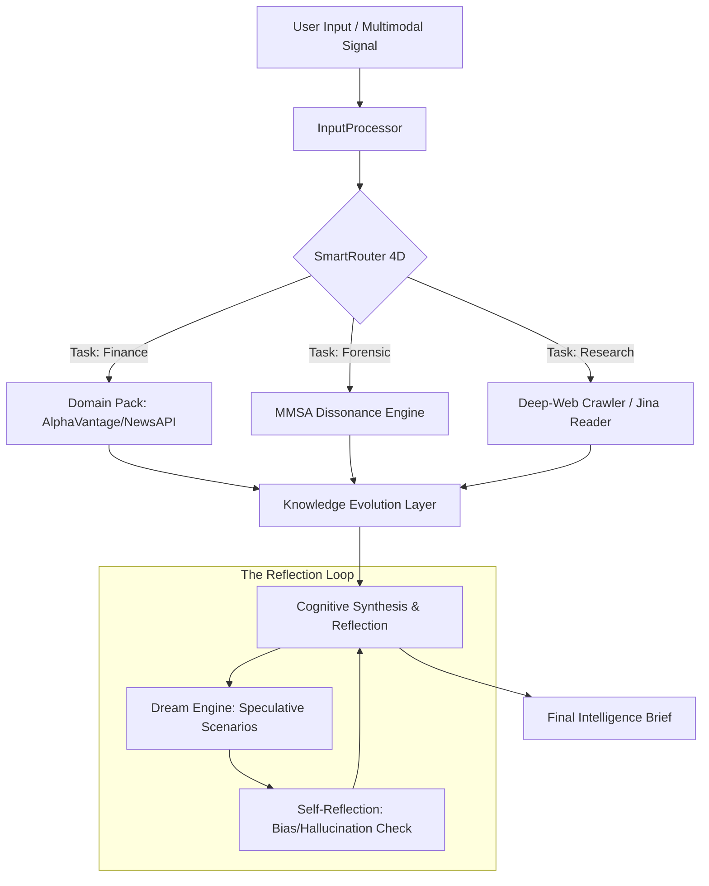

# 🛡️ Janus: The Multimodal Intelligence Sentinel

[](https://opensource.org/licenses/MIT)
[](https://www.python.org/downloads/)
[](https://nextjs.org/)
[](https://huggingface.co/spaces/DevodG/Janus-backend)

Janus is a state-of-the-art, self-evolving **Multimodal Intelligence System** designed for high-fidelity financial research and proactive **ZeroTrust** threat interception. It operates as a cognitive agentic swarm that doesn't just process data—it **dreams**, **reflects**, and **detects deception** in real-time.

---

## 🧠 Core Intelligence: Cross-Modal Emotion Conflict Detection
> **"What you say ≠ how you feel."**

One of Janus's flagship forensic capabilities is identifying **Emotional Dissonance**. Humans often rely on tone to detect sarcasm or deception; Janus automates this by measuring the divergence between spoken tone and transcript meaning.

### 🔬 The Dissonance Engine
*   **Audio Embedding**: High-fidelity prosody analysis using **wav2vec2** (`ehcalabres/wav2vec2-lg-xlsr-en-speech-emotion-recognition`).
*   **Text Embedding**: Sentiment extraction using **DistilBERT** (`bhadresh-savani/distilbert-base-uncased-emotion`).
*   **Fusion Logic**: Computes a **Cosine Divergence Score** between the two probability distributions.
*   **Dataset Calibration**: Continuous self-refinement against the **CMU-MOSEI** and **CREMA-D** datasets to identify subtle sarcasm, irony, and emotional masking.

---

## 🌊 Cognitive Signal Flow
Every signal entering the Janus cluster undergoes a multi-stage cognitive transformation:



---

## 🛡️ ZeroTrust & Forensic Guardian
Janus is built to intercept "Scam Journeys" before they manifest:
- **Active Interception**: Autonomous signal squashing for confirmed malicious trajectories.
- **Relational Threat Mapping**: Tracks scattered entities (phone numbers, URLs, crypto addresses) in the persistent **ScamGraph**.
- **Forensic Safety Gateway**: A dedicated portal for deep-probing SMS, chat logs, and malicious files using OCR and multimodal analysis.

## 📈 Financial & Adaptive Intelligence
- **Autonomous Curiosity**: Continuous background scanning of global markets and sentiment shifts via the **Curiosity Engine**.
- **Mirofish Simulation**: Predictive scenario modeling (Monte Carlo) for market volatility and opportunity forecasting.
- **Knowledge Ingestion**: Automatic distillation of web evidence into a persistent, freshness-aware knowledge base.

---

## 🚀 Deployment & Tech Stack

### Tech Stack
*   **Backend**: FastAPI, PyTorch, Transformers (wav2vec2, BERT), MediaPipe, librosa.
*   **Frontend**: Next.js 14, Tailwind CSS, Lucide React, Framer Motion.
*   **Data**: ScamGraph (Relational), Mirofish (Simulation), Jina (Web Reader).

### Setup & Run
Janus is fully containerized. To run the complete cluster locally:

```bash
# 1. Clone the repository
git clone https://github.com/DevodG/Janus.git
cd Janus

# 2. Run the unified development environment
./run-dev.sh
```

### Environment Secrets
To enable full cognitive capability, configure the following in `.env`:
- `HUGGINGFACE_API_KEY`: Core reasoning models.
- `TAVILY_API_KEY`: Deep-web research access.
- `NEWS_API_KEY`: Real-time financial signals.
- `ALPHAVANTAGE_API_KEY`: Market data integration.

---

> [!IMPORTANT]
> Janus is an **Autonomous Learning System**. Every interaction refines its internal "Skills" and "Prompt Weights," making it more precise with every case it resolves.

*Janus Adapts. Janus Dreams. Janus Protects.*
